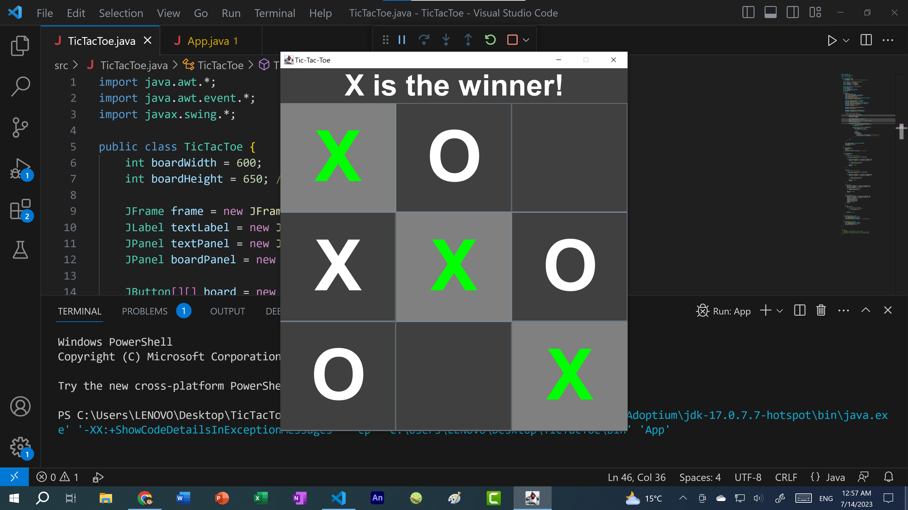

# Tic Tac Toe

Game Description: Tic-Tac-Toe in Java
Overview: This Tic-Tac-Toe game is a graphical implementation of the classic two-player game, developed in Java using Swing for the GUI. The game is played on a 3x3 grid, and players take turns marking a square with their respective symbols, "X" or "O". The objective is to be the first to get three of your symbols in a row, either horizontally, vertically, or diagonally. The game is designed to be visually engaging and straightforward to play, with an intuitive interface and clear indications of the game's progress and results.

Game Interface:

Main Frame: The game window has a main frame sized at 600x650 pixels, with a title "Tic-Tac-Toe".
Text Panel: At the top of the window, a text panel displays messages, such as whose turn it is or the winner. The text is large and bold, ensuring it's easy to read.
Game Board: The main game area consists of a 3x3 grid of buttons. Each button represents a cell on the Tic-Tac-Toe board.
Gameplay Mechanics:

Turn-Based Play: The game begins with player "X" making the first move. Players alternate turns, clicking on any empty cell to place their symbol ("X" or "O").
Winning and Tie Conditions:
The game automatically checks for a winner after every move. A player wins by getting three of their symbols in a row, either horizontally, vertically, or diagonally.
If all cells are filled and no player has achieved three in a row, the game ends in a tie.
Game Over Indication: Once the game is over (either by a win or a tie), the game board is highlighted:
Winning Row/Column: The winning three tiles are highlighted in green, and the background changes to gray.
Tie: In the event of a tie, all tiles are highlighted in orange.
Reset: While the code provided does not include a reset button, it could easily be added to allow players to start a new game after a win or tie.
Visual Design:

The game has a sleek, modern design with a dark gray background and white text, giving it a clean, professional look. The tiles are large and bold, ensuring that the game is easily visible and playable on any screen size.

